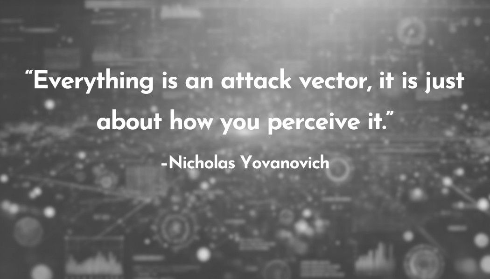

## "Everything is an attack vector. it is just about how you perceive it."

When I got into DevSecOps, I started seeing security differently. It wasn’t just about patching vulnerabilities or running scans. It was about how people think. Security isn’t just about defense—it’s about perception.

Threat modeling changed the way I think. Instead of just looking for known vulnerabilities, I started asking, "How would an attacker see this?" I realized that security isn’t just about fixing problems—it’s about finding opportunities before someone else does.

- A CI/CD pipeline? An attack vector.  
- A misconfigured IAM role? An attack vector.  
- An error message that reveals too much? An attack vector.  
- A chatbot prompt? An attack vector.  

Most people only see threats after they’ve been exploited. But by the time there’s a CVE, it’s already too late. Real security is about seeing attack vectors before they’re obvious. It’s about questioning everything.

That mindset applies everywhere: AppSec, Cloud Security, AI Security, Social Engineering. It’s all the same game.

- Attackers use phishing because people trust emails too much.  
- They exploit misconfigurations because assumptions are dangerous.  
- They use prompt injections because no one thought about adversarial inputs.  

### **That’s why I believe:**  
**Everything is an attack vector. It’s just about how you perceive it.**  

The question is, what attack vectors are people overlooking right now?

